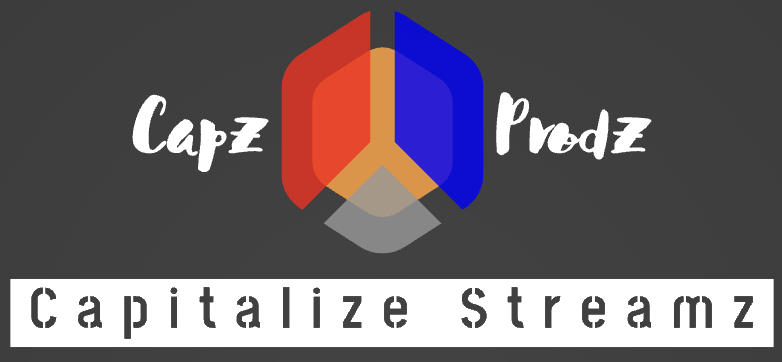

<!-- PROJECT LOGO -->
<br />
<div align="center">
<a>
   
  </a>

  <h3 align="center">Capitalize Streamings</h3>

  <p align="center">
    This is a streaming Plateform for independent and small budget film makers. It's also a convenient inventory management application.
    <br />
    <br />
    <br />
</div>


<!-- TABLE OF CONTENTS -->
<details>
  <summary>Table of Contents</summary>
  <ol>
    <li>
      <a href="#about-the-project">About The Project</a>
      <ul>
        <li><a href="#built-with">Built With</a></li>
      </ul>
    </li>
    <li>
      <a href="#getting-started">Getting Started</a>
      <ul>
        <li><a href="#prerequisites">Prerequisites</a></li>
        <li><a href="#installation">Installation</a></li>
      </ul>
    </li>
    <li><a href="#usage">Usage</a></li>
    <li><a href="#roadmap">Roadmap</a></li>
    <li><a href="#contributing">Contributing</a></li>
    <li><a href="#license">License</a></li>
    <li><a href="#contact">Contact</a></li>
    <li><a href="#acknowledgments">Acknowledgments</a></li>
  </ol>
</details>


<!-- ABOUT THE PROJECT -->
## About The Project


Welcome to Capitalize Productions Streams! This plateform aim to provide a space where small budget teams can share their art to the world while reatining maximum ownership of their intellectual property. No more bending down to the big players. No more middle men! 

Browsing Film Inventory: Search for short films, full films, documentaries, animations etc. We have them all.

Secure Purchase and Direct Support of Creators: At Capz Streamz nearly 100% of what you pay go to the creators we only take a small convenience fee to maintain this plateform.

Real-Time Availability Updates: Stay informed about the availability of movies. The plateform provides real-time updates on the availability of each film, ensuring you don't miss out on the opportunity to watch the next award winning content or the next big great creators in the film industry.


<p align="right">(<a href="#readme-top">back to top</a>)</p>


<!-- GETTING STARTED -->
## Getting Started

To get started with the plateform, follow the instructions below:

### Prerequisites

Fork and clone this repository to your local machine and ensure you have the necessary dependencies installed.

### Installation

_Below is a Quick guide on how you can install and setup the app._

1. Navigate to the desired directory.
2. Clone the fork the repository using the github desktop app or with the following command in your terminal:
    ```sh
    git clone [repo-URL]
    ```
3. Install NPM packages
   ```sh
   npm install
   ``` 
<p align="right">(<a href="#readme-top">back to top</a>)</p>


<!-- USAGE EXAMPLES -->
## Usage

Explore the Catalog: Browse through the available items. Take your time to discover the whole catalog.

Select and Purchase: Once you've found a film you'd like to acquire, simply follow the instructions to select the item and proceed with the purchase. If you wish to have a physical copy and it is in Stock you will be prompted to enter additional information after payment.

Enjoy Your Digital Treasure: After a successful purchase, the creators will thank you and you may watch some advertisement to support the website's team in their work. Enjoy your newly acquired treasure!

<p align="right">(<a href="#readme-top">back to top</a>)</p>


<!-- CONTRIBUTING -->
## Contributing

Any contributions you make are **greatly appreciated**.

If you have a suggestion that would make this better, please fork the repo and create a pull request. 

1. Fork the Project
2. Create your Feature 
3. Commit your Changes (`git commit -m 'Add new Feature'`)
4. Push to the Branch (`git push`)
5. Open a Pull Request

<p align="right">(<a href="#readme-top">back to top</a>)</p>


<!-- LICENSE -->
## License

Distributed under the MIT License. See `LICENSE.txt` for more information.

<p align="right">(<a href="#readme-top">back to top</a>)</p>


<!-- CONTACT -->
## Contact

Daniel Balhazar - danielbalthazar@pursuit.org

Project Link: [https://github.com/tru-salomon/Project-2-10.1-Module-2](https://github.com/tru-salomon/Project-2-10.1-Module-2)

<p align="right">(<a href="#readme-top">back to top</a>)</p>
